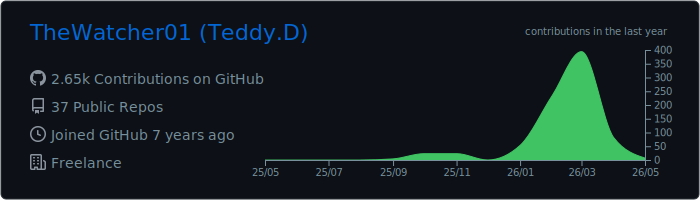
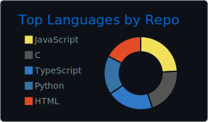
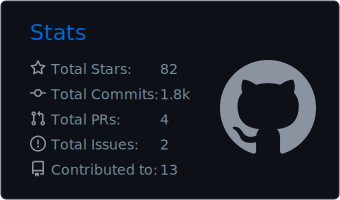
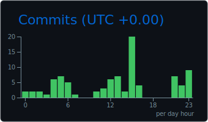

### Teddy Deberdt

Full-stack & DevOps, Toulouse, France. Self-hosted, open-source, zero paid SaaS.

OSINT · Data Engineering · AI/ML · Automation · Crawlers/Scrapers · Sovereign Infrastructure

Background in mechanics, electronics and biology (heavy vehicle maintenance, nursing school).
I design software architectures like physical systems: modular, circular, self-regulated, vendor-agnostic.

---

#### Data & AI

| Project | Description | Stack |
|---------|-------------|-------|
| **albert** | Multi-agent AI assistant — 6 specialized agents, self-hosted gateway | TypeScript, Docker |
| **[datalake-souverain](https://github.com/TheWatcher01/datalake-souverain)** | French public data lake — 29M+ rows, 20 autonomous crawlers | TypeScript, PostgreSQL, pgvector |
| **[subvention-ai](https://github.com/TheWatcher01/subvention-ai)** | Smart grant search engine for businesses | Next.js, Hono, PostgreSQL |
| **knowledge_base** | RAG platform — multi-source ingestion, chat, vector pipeline | Next.js, FastAPI, pgvector, Tika |
| **[ai-hub](https://github.com/TheWatcher01/ai-hub)** | Personal AI/ML R&D lab — self-hosted LLM experimentation, model benchmarking, prompt engineering | Svelte, Python, Ollama |
| **[chainskills](https://github.com/TheWatcher01/chainskills)** | CLI — natural language AI workflows | TypeScript |
| **[skills](https://github.com/TheWatcher01/skills)** | Reusable skills for AI agents | Python |
| **[arsenal](https://osintframework.com/)** | OSINT arsenal — 250+ tools across SOCMINT, GEOINT, threat intel, public records | Python, Bash, Multi |

#### Business Apps

| Project | Description | Stack |
|---------|-------------|-------|
| **recolte** | Farm-to-table marketplace — local producers, Stripe Connect | TypeScript, Next.js |
| **metha-smart** | Agricultural biogas optimizer — real-time simulation, offline PWA | JavaScript |
| **kiloutout** | Multi-service concierge — booking, billing, scheduling | TypeScript, PWA |
| **beato_tp** | AI assistant for construction project management | TypeScript, Prisma |

#### Infrastructure & Tools

| Project | Description | Stack |
|---------|-------------|-------|
| **[zeroclaw](https://github.com/TheWatcher01/zeroclaw)** | Autonomous AI assistant infra — deploy anywhere, swap anything | Rust |
| **[openclaw](https://github.com/TheWatcher01/openclaw)** | Personal AI assistant — fork with custom agents | TypeScript, Docker |
| **arsenal** | OSINT toolkit — 250+ tools, 30 use cases, public data | Multi |

---

#### Agentic & AI Infrastructure

Custom-built multi-agent ecosystem running on self-hosted infrastructure:

| Component | What it does |
|-----------|-------------|
| **OpenClaw Gateway** | Multi-agent orchestration — routes requests to 6 specialized agents (Dev, OSINT, Compliance, ADHD Coach, Business Intel, Wellness) |
| **CRAG System** | Corrective RAG — KV store + vector memory + knowledge graph, offline-first with Ollama |
| **TheWatcher Blocks** | 35+ scaffolding templates — eliminates boilerplate, generates adapters/crawlers/schemas/workflows from blocks |
| **chainskills** | Natural language workflow engine — define, compose, share & run agent workflows as `.workflow.md` files |
| **Datalake pgvector** | 29M+ rows of French public data with vector embeddings — feeds SubventionAI, Recolte, Albert |
| **Stalwart + Listmonk** | Self-hosted mail stack — transactional, campaigns, DKIM/SPF/DMARC, zero external dependency |
| **58 Custom Skills** | Agent capabilities — OSINT, data pipes, energy management, ML, Telegram notifications, workstation cache sync |
| **5 LEA Agents** | Mentor, Migration, Plan, Review, WordPress — configured for non-profit workflow automation |

---

#### Highlight — Association LEA (957h in 2 months)

Full infrastructure deployment from zero for a non-profit (Lutter, Ecouter, Accompagner):

| What | Details |
|------|---------|
| **Apps built** | SubventionAI (grant calendar + AI autofill), HandiPret (medical equipment PWA), 2 headless WordPress + Next.js frontends |
| **Sovereign cloud** | 28 open-source services on a single VPS — Coolify, Nextcloud, Mattermost, Jitsi, Authentik SSO, Matomo, Mautic, Listmonk, Plane, Uptime Kuma, Vaultwarden, SearXNG |
| **LMS migration** | Proprietary Workleap to self-hosted Moodle — 6 active courses |
| **Security** | 7 audit phases, 101/101 tests passing, rate limiting, CSRF, JWT, IDOR fixes, zero critical vulnerabilities |
| **Infra** | Traefik v3, wildcard SSL, Docker Compose, PostgreSQL, MariaDB, 12 vCores / 48 GB RAM |

---

#### Areas of Expertise

```
Crawling & Scraping     ██████████  French public data, SIRENE, Agence Bio, public tenders
Data Engineering        ██████████  ETL, pipelines, PostgreSQL, pgvector, 29M+ rows
AI & RAG                ████████░░  Multi-model agents, embeddings, vector ingestion
OSINT & Intelligence    ████████░░  SOCMINT, GEOINT, open sources, automated enrichment
Automation & DevOps     ██████████  Docker, CI/CD, Caddy, mail stack, sovereign infra
Agentic Systems         ████████░░  Multi-agent orchestration, custom skills, workflow automation
Full-stack              ████████░░  Next.js, Hono, TypeScript, Svelte, Python
```

#### Cross-skills

Complex systems diagnostics (15 years), feedback loop thinking, biomimetic approach to software architecture, compulsive autodidact, tree-based R&D.

#### Services

Custom development, data pipelines, self-hosted infrastructure, AI integration, agentic systems, OSINT.

---

#### Stack

TypeScript · Python · Rust · Docker · PostgreSQL · pgvector · Node.js · Next.js · FastAPI · Caddy · Linux · Ollama · Playwright

---

<p align="center">
  <a href="https://github.com/TheWatcher01">
    
  </a>
</p>

<p align="center">
  <a href="https://github.com/TheWatcher01">
    
  </a>
  <a href="https://github.com/TheWatcher01">
    
  </a>
  <a href="https://github.com/TheWatcher01">
    
  </a>
</p>

---

**Contact** : [teddydeberdt@dev31.fr](mailto:teddydeberdt@dev31.fr) · [LinkedIn](https://linkedin.com/in/teddy-deberdt) · [dev31.fr](https://dev31.fr)
